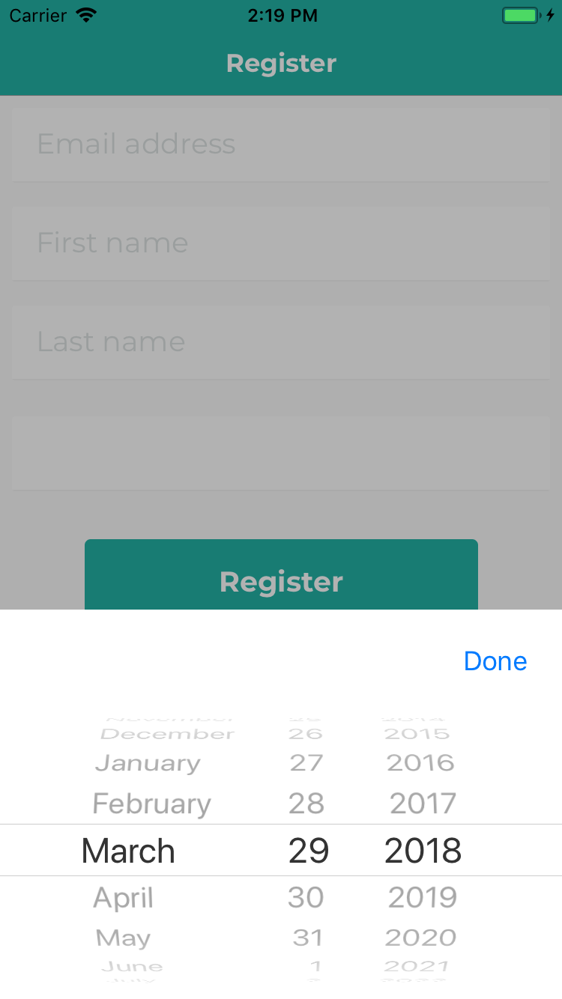
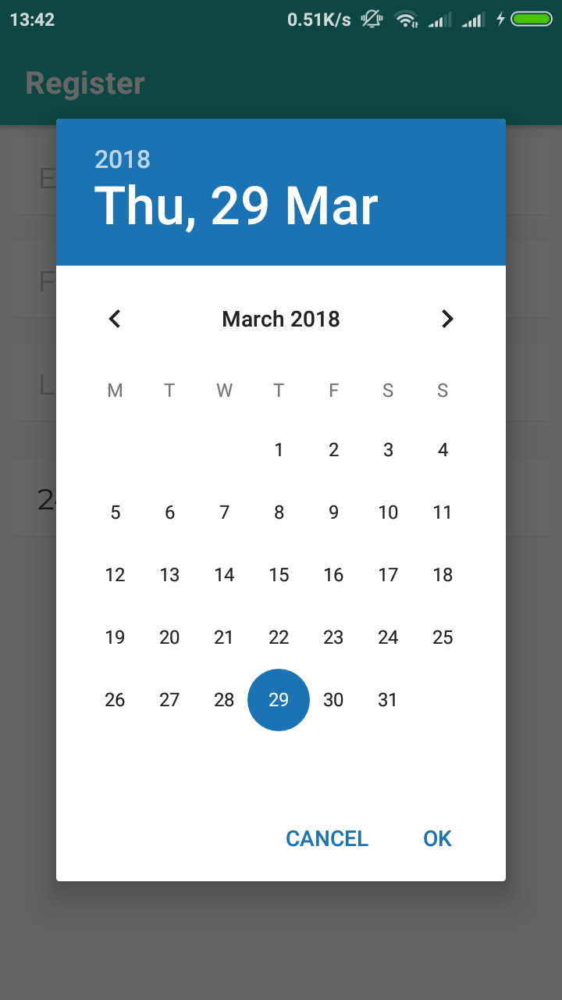

<div align="center">
  
  
</div>

# react-native-datepicker-modal
[](https://npmjs.org/package/react-native-datepicker-modal)
[](https://npmjs.org/package/react-native-datepicker-modal)
[](https://github.com/RichardLitt/standard-readme)
[](https://npmjs.org/package/react-native-datepicker-modal)
[](http://makeapullrequest.com)

> React Native DatePicker Modal Component for iOS/Android

## Table of Contents

- [Install](#install)
- [Usage](#usage)
- [Properties](#properties)
- [Contribute](#contribute)
- [License](#License)

## Install

This project uses [node](https://nodejs.org) and [npm](https://www.npmjs.com). 

```sh
$ npm install react-native-datepicker-modal
$ # OR
$ yarn add react-native-datepicker-modal
```

## Usage

```js
import React from 'react'
import { StyleSheet, Text } from 'react-native'

import ModalDatePicker from 'react-native-datepicker-modal'

import colors from './config/colors'
import spacing from './config/spacing'
import fontSize from './config/fontSize'

const DatePicker = ({ style, ...props }) => (
  <ModalDatePicker
    style={[styles.container, style]}
    renderDate={({ year, month, day, date }) => {
      if (!date) {
        return <Text style={[styles.text, styles.placeholderText]}>Date of birth</Text>
      }

      const dateStr = `${day}-${month}-${year}`
      return <Text style={styles.text}>{dateStr}</Text>
    }}
    {...props}
  />
)

const styles = StyleSheet.create({
  container: {
    backgroundColor: colors.white,
    borderBottomColor: colors.gray.veryLight,
    borderBottomWidth: 1,
    marginVertical: spacing[1],
    marginHorizontal: spacing[0],
    justifyContent: 'center',
    borderRadius: 2,
    height: 50
  },
  placeholderText: {
    color: colors.gray.light
  },
  text: {
    width: '100%',
    paddingHorizontal: spacing[1],
    paddingVertical: spacing[0],
    fontFamily: 'Montserrat',
    fontSize: fontSize.medium,
    color: colors.gray.dark
  }
})

export default DatePicker

```

## Properties

Component accepts the following propeties. Please see [propTypes](index.js) for more detail.

### `renderDate`

Function to render Component for date. Receives object with selected `date`, `year`, `day` and `month`.

### `startDate`

Start date for DatePicker (Default: Current Date `new Date()`).

### `onError`

Function called with error argument if there is error setting date.

### `onDateChanged`

Function called when new date has been selected. Receives object with selected `date`, `year`, `day` and `month`.

### `minDate`

Minimum date that can be selected.

### `maxDate`

Maximum date that can be selected.

### `modalButtonText`

Text string for the iOS modal button (default: "Done")

### Styling

Styling for different sub-components can also be configured:
  - `style`: Styles for the container of `renderDate`.
  - `modalButtonStyle`: Styles for the modal button.
  - `modalBtnContainerStyle`: Styles for the modal button container.
  - `modalStyle`: Styles for the modal.
  - `modalOverlayStyle`: Styles for the modal overlay.

## Contribute

1. Fork it and create your feature branch: git checkout -b my-new-feature
2. Commit your changes: git commit -am 'Add some feature'
3.Push to the branch: git push origin my-new-feature 
4. Submit a pull request

## License

MIT
    
